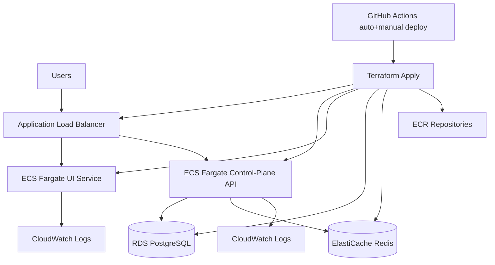

# SLO-Driven Feature Flag Platform

A portfolio-oriented feature flag platform demonstrating distributed systems design, deterministic evaluation logic, and production engineering discipline.

[](https://github.com/jmahotiedu/feature-flag-platform/actions/workflows/ci.yml)


## Cloud Deployment Status

Cloud infrastructure was deployed live on AWS on 2026-02-18, smoke-tested on 2026-02-19, and deprovisioned on 2026-02-19 to manage costs.

To reproduce:

```bash
./scripts/deploy.sh
./scripts/cloud-smoke.sh
```

## 90-Second Reviewer TL;DR

If you have under 90 seconds, run this:

```bash
npm run quickstart:smoke
```

It starts the control-plane, performs create/publish/evaluate/rollback checks, validates idempotency replay, and writes a report to `docs/demo/live-e2e-report.md`.

## Features

This project implements:
- Multi-tenant feature flag control-plane API.
- Deterministic rule + percentage rollout evaluation.
- JavaScript SDK with local cache and refresh loop.
- Admin UI for listing/creating/publishing flags.
- Metrics, load-test scripts, and operations docs.
- Tenant quota controls with usage endpoint (`GET /api/tenants/:tenantId/quotas`).

## Tech Stack

| Layer | Technology |
|-------|-----------|
| Language | TypeScript (Node.js 22) |
| API | Express, REST |
| Database | PostgreSQL (RDS) |
| Cache | Redis (ElastiCache) |
| Frontend | React, Vite |
| Infrastructure | Terraform, ECS Fargate, ALB, ECR |
| Observability | Prometheus, Grafana, CloudWatch |
| CI/CD | GitHub Actions |
| Testing | Vitest, load testing |

## Architecture

- `control-plane/`: API, auth/RBAC, idempotency middleware, rate limits, audit log, distribution events.
- `shared/`: common types, validation, and deterministic evaluation engine.
- `sdk/js/`: client cache + refresh and local flag evaluation.
- `ui/`: admin console for flag CRUD/publish actions.
- `loadtest/`: reproducible control-plane and SDK latency scripts.

## Quickstart

### Prerequisites

- Node.js 22+
- Docker (optional, for Postgres/Redis/Prometheus/Grafana)

### Install

```bash
npm run setup
```

### Run services (optional)

```bash
npm run dev-up
```

### Run app containers (local parity with AWS images)

```bash
npm run dev-up:full
```

### Start control-plane

```bash
npm run dev:control-plane
```

### Start UI

```bash
npm run dev:ui
```

### Run tests

```bash
npm run test
```

### Run live demo and incident drill

```bash
npm run demo:e2e-live
npm run drill:incident
npm run drill:redis-stale
```

## Cloud Deployment

### AWS Architecture



### Deploy / Teardown

Terraform uses S3 backend state with DynamoDB locking (bootstrapped in script).

```bash
export DB_PASSWORD='replace-with-strong-password'

# Plan + apply
./scripts/deploy.sh

# Plan only
APPLY=false ./scripts/deploy.sh

# Cloud smoke (ALB + /api/health)
./scripts/cloud-smoke.sh

# Teardown infra
./scripts/teardown.sh
```

GitHub Actions deploy workflows:
- Auto deploy on push (main): `.github/workflows/auto-deploy.yml`
  - Builds/pushes images with immutable SHA tag, applies Terraform, and runs `scripts/cloud-smoke.sh`.
  - Includes preflight secret guard and skips safely when deploy secrets are unavailable.
- `.github/workflows/terraform-deploy.yml`
- Unified multi-project teardown script: `~/projects/scripts/teardown-all.sh`

Estimated running cost (continuous): about `$45-$95/month`.

### Deployment Evidence

<details>
<summary>AWS apply + smoke artifacts (Feb 2026)</summary>

- Dry-run plan executed on `2026-02-18` via `scripts/deploy.sh` (`APPLY=false`).
- Result: `Plan: 35 to add, 0 to change, 0 to destroy`.
- State backend bootstrap confirmed:
  - S3 state bucket created
  - DynamoDB lock table created
- Live apply executed on `2026-02-18` via `scripts/deploy.sh` (`APPLY=true`).
- Historical ALB URL (now deprovisioned): `http://feature-flag-demo-alb-1145770048.us-east-1.elb.amazonaws.com`
- Health verification at deploy time:
  - `GET /api/health` -> `200 {"ok":true}`
  - `GET /` -> `200`
- Functional verification (`2026-02-19`):
  - `GET /api/flags` with `Authorization: Bearer admin-token` + `x-tenant-id: tenant-a` -> `200`
  - `GET /api/tenants/tenant-a/quotas` with the same headers -> `200`
- Repeatable verification script: `scripts/cloud-smoke.sh`.

</details>

### Cloud Demo Notes (When Deployed)

- The admin UI requires both a token and tenant context.
- Defaults are `admin-token` and `tenant-a`, and both can be changed in the UI.
- If a tenant has no data yet, the UI will be empty until you create flags or use the built-in seed action.
- No third-party API keys are required for demo usage.

## API auth

Default tokens:
- `admin-token` -> `admin`
- `operator-token` -> `operator`
- `viewer-token` -> `viewer`

Use `Authorization: Bearer <token>` and `x-tenant-id: <tenant>` for tenant-scoped reads.

## Performance and reliability artifacts

- Control-plane load report: `docs/benchmarks/control-plane-load-report.json`
- SDK evaluation report: `docs/benchmarks/sdk-eval-report.json`
- Incident drill runbook: `docs/runbooks/incident-drill.md`
- SLO dashboard provisioning: `infra/grafana/dashboards/slo.json`

## Trade-offs

- In-memory storage is used for local development speed; SQL migrations are provided for production persistence shape.
- At-least-once publish propagation semantics are preferred over exactly-once complexity for v1.
- Idempotency is request-key based and scoped by token + route for safe retry behavior.
- AWS deployment provisions RDS and Redis for managed service topology; current control-plane runtime remains in-memory unless persistence integration is enabled in application code.
