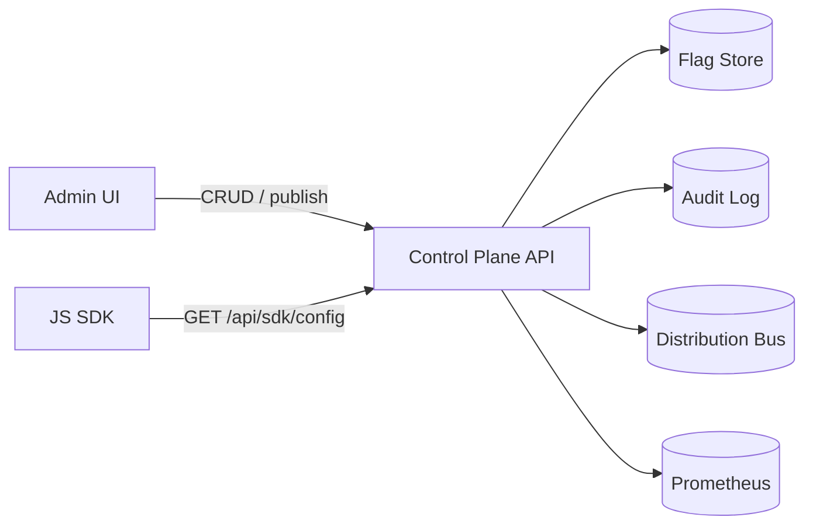

# Architecture

## Overview

## Data model

Core entities:
- `environment`
- `segment`
- `flag`
- `flag_version`
- `audit_event`

## Reliability controls

- Request idempotency for mutating endpoints (`Idempotency-Key`).
- Per-tenant and global request throttles.
- Deterministic evaluation with stable hash bucketing.
- Event stream endpoint for publish notifications (`/api/events`).
